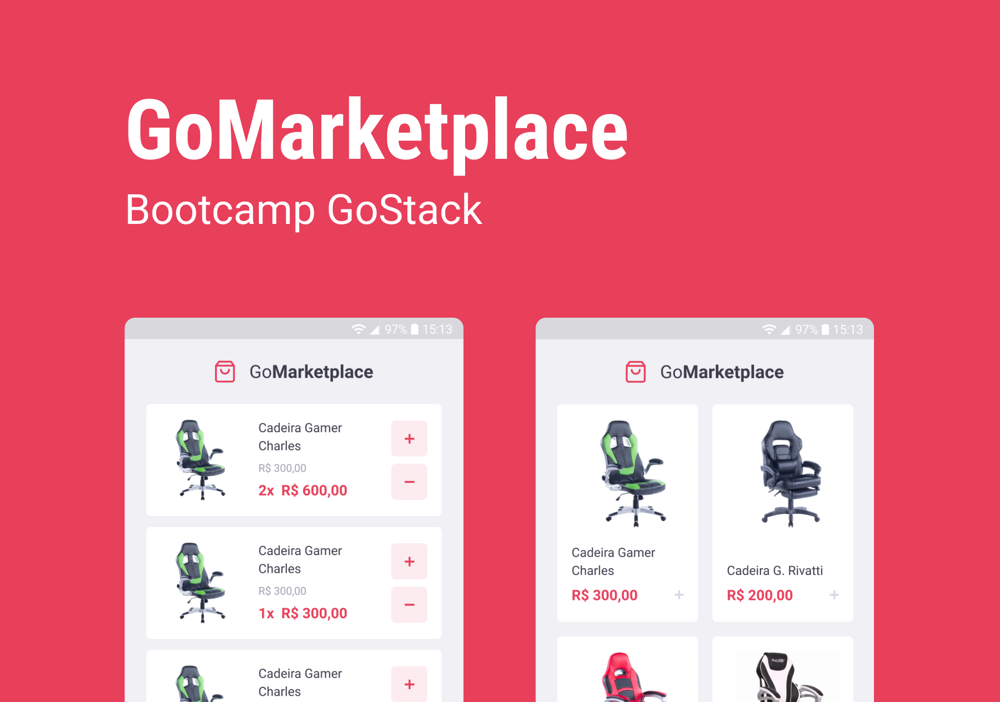
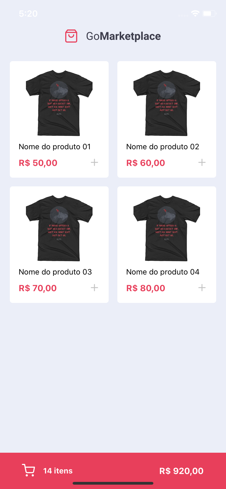

<h1 align="center">
    
</h1>

<h3 align="center"> 
	Aplicativo de compras 🛒
</h3>
<p align="center">
  

  <a href="https://github.com/leoskrr/GoMarketplace/commits/master">
    
  </a>
  
  

<p align="center">
  <a href="#-projeto">Projeto</a>&nbsp;&nbsp;&nbsp;|&nbsp;&nbsp;&nbsp;
  <a href="#rocket-Tecnologias">Tecnologias</a>&nbsp;&nbsp;&nbsp;|&nbsp;&nbsp;&nbsp;
  <a href="#-como-executar">Como executar</a>&nbsp;&nbsp;&nbsp;|&nbsp;&nbsp;&nbsp;
  <a href="#-como-contribuir">Como contribuir</a>
</p>

## 📱 Projeto

O GoMarketplace é um aplicativo (Android e iOS) para compra de produtos utilizando FakeAPI. O mesmo foi construído durante o Bootcamp GoStack 12 da <a href="https://www.rocketseat.com.br">Rocketseat</a>

<p align="center">
    
    
</p>


## :rocket: Tecnologias

Esse projeto foi construído com a tecnologia:

- [React Native](https://facebook.github.io/react-native/)

## :information_source: Como executar

Para clonar e executar esse projeto você precisa ter instalado em sua máquina o [Git](https://git-scm.com), o [Node.js][nodejs] e o [Yarn][yarn].

Dentro do seu terminal:

```bash
# Clone este repositório
$ git clone https://github.com/leoskrr/GoMarketplace.git

# Entre na pasta criada
$ cd GoMarketplace

# Instale as dependencias
$ yarn

# Inicie o servidor
$ yarn json-server server.json -p 3333

# Abra a aplicação no Android (se você tiver)
$ yarn android

# Abra a aplicação no iPhone (se você tiver)
$ yarn ios
```

### Testes

Para executar os testes, digite, ainda no terminal: 
```bash
$ yarn test
```

## 🤔 Como contribuir

- Faça um fork desse projeto;
- Crie uma branch com sua(s) mudança(s): `git checkout -b my-feature`;
- Faça um commit da(s) sua(s) mudança(s): `git commit -m 'feat: My new feature'`;
- Crie uma pull request nesse repositório.

---

<p align="center">With 💜, by Leonardo Viana.</p>

[nodejs]: https://nodejs.org/
[yarn]: https://yarnpkg.com/
[vc]: https://code.visualstudio.com/
[vceditconfig]: https://marketplace.visualstudio.com/items?itemName=EditorConfig.EditorConfig
[vceslint]: https://marketplace.visualstudio.com/items?itemName=dbaeumer.vscode-eslint
[prettier]: https://marketplace.visualstudio.com/items?itemName=esbenp.prettier-vscode
